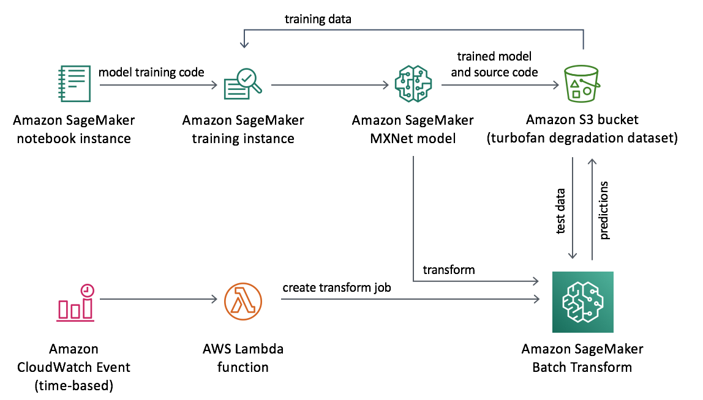

# Predictive Maintenance using Machine Learning

Companies need to monitor their industrial assets to ensure sustained performance and the typical manual routine checkups are time-consuming and reactive. However, with the advent of cheap sensors, companies can get metrics from industrial assets at regular intervals and with this trove of data, companies can use machine learning models to predict when assets might fail.

This project shows how to use Amazon SageMaker to train a deep learning model that uses historical sensor readings to predict how much longer the asset is likely to work for before it becomes critical. As a demonstration, the project trains an MXNet model on the [NASA turbofan engine dataset](https://data.nasa.gov/dataset/Turbofan-engine-degradation-simulation-data-set/vrks-gjie), but can be easily customized to work with other sensor based data.

## Getting Started

To get started quickly, use the following quick-launch link to launch a CloudFormation Stack create form and follow the instructions below to deploy the resources in this project.

| Region | Stack |
| ---- | ---- |
|US East (N. Virginia) |   |
|US East (Ohio) |   |
|US West (Oregon) |  |

### Additional Instructions

* On the stack creation page, ensure that the option to **Launch SageMaker Notebook Instance** under SageMaker configurations is set to **Yes**, check the boxes to acknowledge creation of IAM resources, and click **Create Stack**. This should trigger the creation of the CloudFormation stack.

* Once the stack is created, go to the Outputs tab and click on the SageMakerNotebook link. This will open up the jupyter notebook in a SageMaker Notebook instance where you can run the code in the notebook.

## Architecture

The project architecture deployed by the cloud formation template is shown here.

## Project Description
The project uses Amazon SageMaker to train a deep learning model with the MXNet deep learning framework. The model used is a stacked Bidirectional LSTM neural network that can learn from sequential or time series data. The model is robust to the input dataset and does not expect the sensor readings to be smoothed, as the model has 1D convolutional layers with trainable parameter that can to smooth and peform feature transformation of the time series. The deep learning model is trained so that it learns to predict the remaining useful life (RUL) for each sensor.

The model training is orchestrated by running a [jupyter notebook](source/notebooks/sagemaker_predictive_maintenance.ipynb) on a SageMaker Notebook instance. When you go through the project demonstration, the nasa turbofan engine dataset is automatically downloaded to an S3 bucket created in your account, by the quick launch template above.

In to demonstrate how the project can be used to perform batch inference on new time series data from sensor readings, an AWS Lambda function (https://github.com/awslabs/predictive-maintenance-using-machine-learning/blob/master/source/predictive_maintenance/index.py) is included. The Lambda function can be invoked by an AWS CloudWatch Event so that it runs on a schedule or AWS S3 put event so that it runs as soon as new sensor readings are stored in S3. When invoked, the Lambda function creates a SageMaker Batch Transform job, which uses the SageMaker Model that was saved during training, to obtain model predictions for the new sensor data. The results of the batch transform job are stored back in S3, and can be fed into a dashboard or visualization module for monitoring. 

## Contents

* `deployment/`
  * `predictive-maintenance-using-machine-learning.yaml`: Creates AWS CloudFormation Stack for solution
* `source/`
  * `predictive-maintenance/`
      * `index.py`: Lambda function script for creating SageMaker Batch Transforms jobs for batch inference
  * `notebooks/`
    * `sagemaker_predictive_maintenance`
      * `sagemaker_predictive_maintenance_entry_point`
        * `requirements.txt`: specifies requirements that need to be present in the SageMaker training container
        * `sagemaker_predictive_maintenance_entry_point.py`: Entry point script containing MXNet implementation for training the model
      * `config.py`: python config file to read cloudformation stack outputs and parametrize the solution
      * `preproces.py`: data preprocessing script
      * `setup.py`: setup the directory as a local python package
      * `utils.py`: utility function around preparing batch transform input and output
    * `sagemaker_predictive_maintenance.ipynb`: Orchestrates the solution. Trains the models and saves the trained model

## License

This project is licensed under the Apache-2.0 License.

